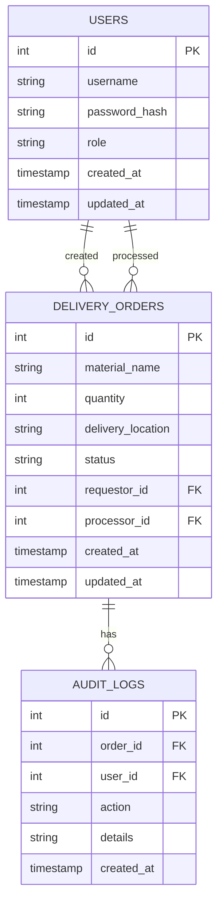

# Data Model Proposal

This document outlines the data model for the Shopfloor Material Supply App.

## 1. ERD (Entity-Relationship Diagram)

A simple ERD for the core entities would look like this:



## 2. Enums

### UserRole
- `PRODUCTION`
- `WAREHOUSE`
- `ADMIN`

### OrderStatus
- `NEW`
- `IN_PREPARATION`
- `IN_TRANSIT`
- `COMPLETED`

## 3. Table Schemas

### `users`

| Column | Data Type | Constraints | Description |
|---|---|---|---|
| `id` | `SERIAL` | `PRIMARY KEY` | Unique identifier for the user. |
| `username` | `VARCHAR(255)` | `NOT NULL, UNIQUE` | User's login name. |
| `password_hash` | `VARCHAR(255)` | `NOT NULL` | Hashed password for security. |
| `role` | `VARCHAR(50)` | `NOT NULL` | User's role (`PRODUCTION`, `WAREHOUSE`, `ADMIN`). |
| `created_at` | `TIMESTAMP` | `DEFAULT CURRENT_TIMESTAMP` | Timestamp of user creation. |
| `updated_at` | `TIMESTAMP` | `DEFAULT CURRENT_TIMESTAMP` | Timestamp of last user update. |

### `delivery_orders`

| Column | Data Type | Constraints | Description |
|---|---|---|---|
| `id` | `SERIAL` | `PRIMARY KEY` | Unique identifier for the order. |
| `material_name` | `VARCHAR(255)` | `NOT NULL` | Name of the requested material. |
| `quantity` | `INTEGER` | `NOT NULL` | Quantity of the material requested. |
| `delivery_location` | `VARCHAR(255)` | `NOT NULL` | Location on the shop floor for delivery. |
| `status` | `VARCHAR(50)` | `NOT NULL` | Current status of the order (`NEW`, `IN_PREPARATION`, etc.). |
| `requestor_id` | `INTEGER` | `FK to users.id` | The user who created the order. |
| `processor_id` | `INTEGER` | `FK to users.id, NULLABLE` | The warehouse user processing the order. |
| `created_at` | `TIMESTAMP` | `DEFAULT CURRENT_TIMESTAMP` | Timestamp of order creation. |
| `updated_at` | `TIMESTAMP` | `DEFAULT CURRENT_TIMESTAMP` | Timestamp of last order update. |

### `audit_logs`

| Column | Data Type | Constraints | Description |
|---|---|---|---|
| `id` | `SERIAL` | `PRIMARY KEY` | Unique identifier for the log entry. |
| `order_id` | `INTEGER` | `FK to delivery_orders.id` | The order the log entry is associated with. |
| `user_id` | `INTEGER` | `FK to users.id` | The user who performed the action. |
| `action` | `VARCHAR(255)` | `NOT NULL` | The action performed (e.g., "STATUS_CHANGE", "DELETE"). |
| `details` | `TEXT` | `NULLABLE` | Additional details about the action (e.g., reason for change). |
| `created_at` | `TIMESTAMP` | `DEFAULT CURRENT_TIMESTAMP` | Timestamp of the log entry. |

```